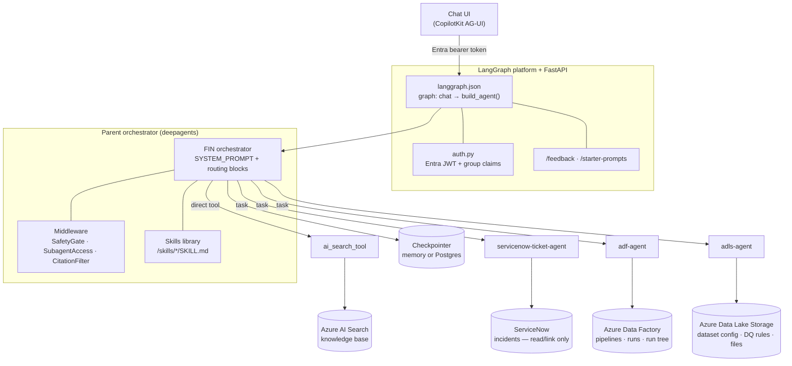
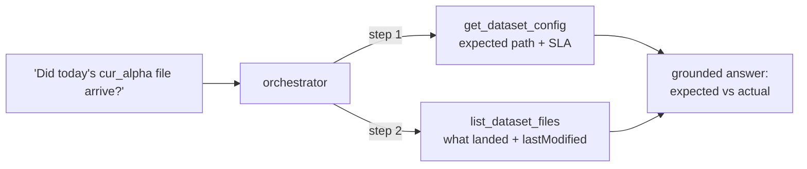

# FIN Virtual AI Assistant — agent orchestration backend

A LangGraph **deep agent**: one parent orchestrator that routes each Production
Support question to the right capability — the knowledge base, ServiceNow
incidents, Azure Data Factory pipelines, or Azure Data Lake Storage files — and
grounds every answer in what those capabilities return.

Served over HTTP by the LangGraph platform (`langgraph.json`) with a FastAPI app
mounted alongside it for feedback and starter prompts.

---

## Architecture



**One capability per step.** The orchestrator prompt forbids invoking two
capabilities in the same step or batch — it calls one, waits, reads the result,
and only then decides whether another is needed. An investigation spanning a
ticket, a pipeline and a file is three sequential delegations.

**Capabilities are conditional.** A subagent is registered *and* its routing
block appended to the system prompt only when its backing resource is
configured. A deployment with no Data Factory or no data lake is never told
about a capability it does not have.

---

## The capabilities

| Capability | Invoked as | What it owns | Enabled by |
|---|---|---|---|
| `ai_search_tool` | direct tool call | policy, documentation, how-to, source-to-target mapping, data lineage, schema | `AZURE_AI_SEARCH_ENDPOINT` |
| `servicenow-ticket-agent` | `task` delegation | incident lookup, search, detail — **read and link only, never create** | `SERVICENOW_*` |
| `adf-agent` | `task` delegation | pipelines, runs, the parent→child run tree, root-cause diagnosis | `ADF_FACTORY_MAPPING` |
| `adls-agent` | `task` delegation | dataset expected path, arrival SLA, file metadata, data quality rules, files that landed | `ADLS_ACCOUNT_MAPPING` |

Each subagent carries its own system prompt and tool set, and returns structured
text the orchestrator presents verbatim.

### `adf-agent` — Azure Data Factory

Five tools: `list_pipelines`, `list_pipeline_runs`, `get_pipeline_run_details`,
`get_pipeline_run_tree`, `get_pipeline_structure`.

The run tree is the interesting one: from **any** run in a family it climbs
`invoked_by.pipeline_run_id` to the root, then walks the whole family back down,
so a failed grandchild still yields the full picture with the root-cause
activity named. See
[docs/architecture/ADF_HIERARCHY_FIX.md](docs/architecture/ADF_HIERARCHY_FIX.md).

### `adls-agent` — Azure Data Lake Storage

Four tools: `list_datasets`, `get_dataset_config`, `get_data_quality_rules`,
`list_dataset_files`.

It answers two kinds of question and never confuses them — **EXPECTED** (where a
file should land, by when, under which DQ rules; from a per-dataset JSON
manifest in the lake) versus **ACTUAL** (what landed, how big, when; from the
blob listing). It reports both and leaves the late/on-time verdict to the
orchestrator and the downstream timeliness capability. See
[docs/architecture/ADLS.md](docs/architecture/ADLS.md).



---

## Access control

Authentication is Entra JWT (`src/v1/utils/auth.py`); the caller's group claims
drive two things at **run time**, not build time:

- **Knowledge-base routing** — `TENANT_GROUP_INDEX_MAPPING` picks the AI Search
  index the caller is authorized for.
- **Subagent gating** — `SubagentAccessMiddleware` reads
  `SERVICENOW_DISABLED_GROUPS` / `ADF_DISABLED_GROUPS` / `ADLS_DISABLED_GROUPS`
  and, for a matching caller, appends an authoritative restriction note to the
  system prompt *and* hard-blocks any stray `task` call to that subagent. The
  `task` tool itself is removed only when **every** registered subagent is
  disabled — a partially restricted caller keeps the ones they are allowed.

Every Azure capability authenticates with `DefaultAzureCredential` — `az login`
locally, managed identity when deployed. ADF and ADLS store no keys and hold
read-only roles (*Data Factory Reader*, *Storage Blob Data Reader*, and
*Storage Table Data Reader* when the DQ rules table is configured).

---

## Layout

```
src/v1/
├── api/            FastAPI app + /feedback, /starter-prompts routes
├── core/
│   ├── agent.py            builds the orchestrator (singleton, conditional subagents)
│   ├── config.py           pydantic-settings; every env var lives here
│   ├── middlewares/        safety gate · subagent access gate · citation filter
│   ├── prompts/            orchestrator + one module per subagent
│   ├── skills/             bundled SKILL.md library, mounted read-only at /skills/
│   ├── subagents/          adf · adls · servicenow definitions
│   └── tools/              adf · adls · ai_search · servicenow · utility
├── test/           offline test suites (no network, no credentials)
└── utils/          auth, Azure credentials, Key Vault, checkpointer, group routing
```

---

## Running it

```bash
uv sync                      # or: pip install -e .
cp .env.example .env         # fill in Azure OpenAI / Search / ServiceNow values
az login                     # ADF + ADLS use your session locally
langgraph dev                # graph + API on http://localhost:2024
```

`PERSISTENCE_BACKEND=memory` (default) keeps threads in process; set it to
anything else together with `POSTGRESS_DATABASE_URL` for the Postgres
checkpointer.

### Tests

```bash
make test    # deterministic offline suites — mock ServiceNow, faked Azure clients
```

| Suite | Covers |
|---|---|
| `test_adf_tools.py` | factory resolution, run listing (filters, date windows, paging), run-tree walk, recursion budget, pipeline structure |
| `test_adls_tools.py` | account resolution, manifest loading, DQ table rows, all five ADLS tools |
| `test_subagent_access.py` | per-group gating for all three subagents |
| `test_servicenow*.py` | ServiceNow client, intents, evaluation |
| `test_agent_recursion.py` | `AGENT_MAX_STEPS` is the authoritative step ceiling |
| `test_graph_groups.py` | Entra group resolution + caching |

### Where the ADLS agent's expectations come from

Storage knows only what physically landed. The **expectations** come from two
read-only configuration sources, each entered from a different starting point:

- **Per-dataset JSON manifests** at `<config_path>/<dataset>.json` in the lake,
  keyed by dataset name — expected path template, arrival SLA (time, timezone,
  grace), file name pattern, source system, ingestion frequency, and
  dataset-level quality rules. Read by `get_dataset_config` and
  `get_data_quality_rules`.
- **A `dq_rules_config` Azure Table** (`ADLS_TABLE_ENDPOINT` + `ADLS_DQ_TABLE`),
  keyed by the dataset/table name — the only thing a ServiceNow DQ ticket
  carries. One row per rule per ETL stage (`LND-TLE`, `PCUR-TLE` timeliness,
  `INT-CLE` completeness) with thresholds, plus a `dq_parameters` JSON holding
  the time target and the expected file path. Read by `get_dq_config`.

Neither supersedes the other and neither is a superset: the manifests carry the
structured SLA and the date-token path template, the Table carries the per-stage
rule rows and the failure/queue routing. `list_dataset_files` reports what
ACTUALLY landed, and the agent presents expected against actual as fact without
pronouncing an on-time/late verdict.

Reading the Table needs *Storage Table Data Reader* on that account, alongside
the existing *Storage Blob Data Reader*. Leave `ADLS_TABLE_ENDPOINT` unset and
`get_dq_config` reports itself as not configured; the manifest-backed tools are
unaffected.

### Deploying

```bash
make preflight   # checks az login, subscription, infra/.env.deploy, Key Vault secrets
make deploy      # builds in ACR and deploys to Azure Container Apps
make logs        # tail the running container
```

Non-secret env comes from `infra/.env.deploy`; secrets come from Key Vault — see
`infra/README.md`.

---

## Configuration highlights

Full descriptions live on the fields in `src/v1/core/config.py`; `.env.example`
is the template.

| Var | Effect |
|---|---|
| `AGENT_MAX_STEPS` | hard recursion ceiling on the parent loop |
| `TENANT_GROUP_INDEX_MAPPING` | Entra group → AI Search index |
| `ADF_FACTORY_MAPPING` | alias → factory coordinates; **empty disables `adf-agent`** |
| `ADLS_ACCOUNT_MAPPING` | alias → `{account_url, filesystem, config_path}`; **empty disables `adls-agent`** |
| `ADLS_TABLE_ENDPOINT` / `ADLS_DQ_TABLE` | the `dq_rules_config` Azure Table; unset leaves `get_dq_config` inactive |
| `SERVICENOW_MODE` | `mock` for offline development |
| `*_DISABLED_GROUPS` | per-subagent access gating |

---

## Docs

- [docs/architecture/ORCHESTRATION_FLOW.md](docs/architecture/ORCHESTRATION_FLOW.md) — end-to-end request flow
- [docs/architecture/ADLS.md](docs/architecture/ADLS.md) — the ADLS agent design + requirement traceability
- [docs/ADLS_ACTION_PLAN.md](docs/ADLS_ACTION_PLAN.md) — the Table-based DQ-rules design
- [docs/architecture/ADF_AGENT_REQUIREMENTS_TRACEABILITY.md](docs/architecture/ADF_AGENT_REQUIREMENTS_TRACEABILITY.md) — every ADF requirement mapped to a tool
- [docs/architecture/ADF_HIERARCHY_FIX.md](docs/architecture/ADF_HIERARCHY_FIX.md) — how the run tree finds the real root cause
