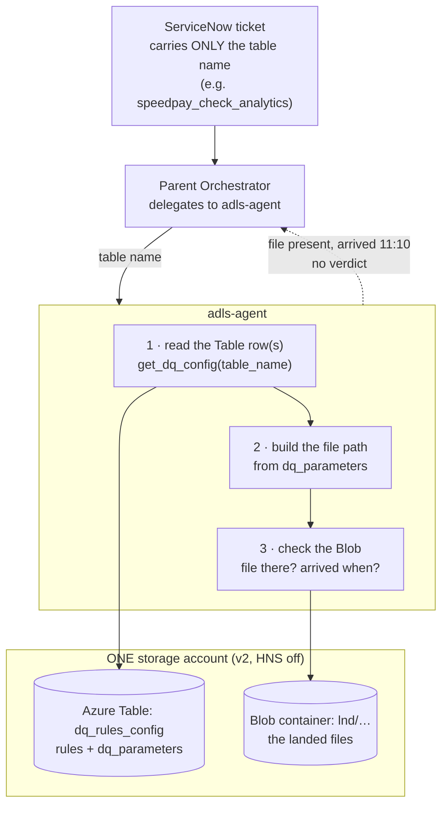

# ADLS Agent — Action Plan & Setup README

**Goal (one paragraph).** Stand up **one storage account** that holds both the
**data-lake files (Blob)** and a **`dq_rules_config` Azure Table**, populate that
Table with the DQ rules from Poonam's screenshots, and make the **ADLS agent**
take a **table name** (as it would come from a ServiceNow ticket) →
**read the Table's rows** → **construct the file path** from the `dq_parameters`
column → **check the Blob** for whether the file arrived and at what time. First
use case: **TLE / timeliness** for `speedpay_check_analytics` (due 11:00, seeded
to arrive 11:10). The ADLS agent returns **data only** (file present? arrived
when?); it does **not** rule on-time/late.

Source of truth for the requirements: [meeting_notes.md](meeting_notes.md)
(Jul 23 entry, action items #21–#30) and the `dq_rules_config` screenshots. This
supersedes the JSON-manifest approach in [adls_design.md](adls_design.md) §5.

---

## 0. Decision you must make first: HNS vs Table service

**Azure constraint (not a preference):** a storage account with **Hierarchical
Namespace enabled (true Gen2)** does **not** offer the **Table** or **Queue**
services — the portal greys them out. So "Blob **and** Table in the *same*
account" (what Yash described — Blob/File/Table/Queue in one account) is only
possible on a **general-purpose v2 account with HNS OFF**.

| Option | Blob (files) | Table (`dq_rules_config`) | Verdict |
|---|---|---|---|
| **A — one v2 account, HNS OFF** *(recommended for the sim)* | ✅ flat blob | ✅ Table service | **Both in one account.** The agent only does flat listing + whole-file reads, so it never needs HNS. |
| B — one Gen2 account (HNS ON) + a second v2 account for the Table | ✅ true Gen2 | ✅ (separate account) | Two accounts; closer to how real NFCU probably splits lake vs config store. |
| C — config in Databricks/Delta instead of Table | ✅ Gen2 | Delta table | Matches real NFCU (`/mnt/raw`, `dq_parameters.raw_path`), heavier to stand up. |

**Recommendation: Option A** for the simulation. It gives Yash exactly what he
asked for — one account, Blob + Table together — and the agent code is identical
because it already treats the lake as flat blobs. Real NFCU is probably B or C;
that only changes *where we read from*, which is one function in the agent (§5).

> **Confirm with Yash (Jul 24–25):** is the real config an **Azure Storage
> Table**, a **Delta table** (Databricks), or the **CSV** we saw on SharePoint?
> The plan below builds Option A; swapping to B/C touches only the table-read
> function.

---

## 1. End-to-end flow (what we're building)



Part 1 (read the Table) is the **must-do first task** — required no matter what
else we build. Part 2+3 (construct path, check the file) is the timeliness
answer.

---

## 2. The Azure Table schema (`dq_rules_config`)

Azure Table storage is a flat key-value store: every row is an **entity** with a
**PartitionKey**, a **RowKey**, and string properties. Map the screenshot columns
straight across; keep `dq_parameters` and `oprl_configs` as **JSON strings** (the
agent parses them).

| Table column (from screenshots) | Table entity property | Notes |
|---|---|---|
| `table_name` | **PartitionKey** | agent looks up by table name → one partition query returns all its rows |
| `etl_stage` + `dq_rule_id` | **RowKey** (e.g. `LND-TLE`) | unique per row; one dataset has several |
| `source` | `source` | `speedpay check` |
| `source_alias` | `source_alias` | `SPEEDPAY CHECK PAYMENTS` |
| `column_name` | `column_name` | `null` on the timeliness rows |
| `etl_stage` | `etl_stage` | `PCUR` / `LND` / `INT` (also `CUR`) |
| `dq_rule_id` | `dq_rule_id` | `TLE` = timeliness, `CLE` = completeness |
| `dq_parameters` | `dq_parameters` (JSON string) | **builds the file path** — see §2a |
| `sort_order`,`active_flag`,`quarantine_flag`,`threshold_cnt`,`threshold_pct` | same names | flags/thresholds |
| `oprl_configs` | `oprl_configs` (JSON string) | on-failure: Snow queue + emails |
| `created_on`,`last_modified_on`,`business_unit`,`notes` | same names | governance |

### 2a. What `dq_parameters` actually contains (confirmed from the screenshots)

```json
{
  "file_name": "speedpay_check_analytics",
  "source_base_folderpath": "speedpay-check/",
  "source_base_path": "abfss://lnd-sourcing2@dt{env}eussensitiveadls.dfs.core.windows.net/lnd/speedpay-check/archive/",
  "raw_path": "/mnt/raw/speedpay-check/",
  "int_table_name": "speedpay_check_analytics",
  "source_system_name": "Speedpaycheck",
  "ingestion_cadence": "Daily",
  "ingestion_days": ["Monday","Tuesday","Wednesday","Thursday","Friday"],
  "partition_column": "md_source_file_date",
  "insert_timestamp": "md_insert_datetime",
  "is_cdc_table": "",
  "day_beginning_check": "True",
  "file_name_options": ["..."]
}
```

**Path construction rule (Part 2):** the file path = `source_base_path` +
`file_name` (with `{filedate}` substituted for the business date). For the sim we
translate that `abfss://` path into our own account's container + prefix (§3b).
The INT row's `file_name` is `{filedate},WU_to_NFCU_speedpay_check_analytics` —
so the concrete file is e.g. `20260724_WU_to_NFCU_speedpay_check_analytics`.

---

## 3. Setup steps (Azure CLI, Option A)

Placeholders: `ACCT=stnfcuadlssim`, `RG=rg-nfcu-adf-wiki`, `LOC=eastus2`.

### 3a. Create the account (v2, **HNS off** so it can host a Table)

```bash
az storage account create -n $ACCT -g $RG -l $LOC \
  --sku Standard_LRS --kind StorageV2 \
  --allow-blob-public-access false --min-tls-version TLS1_2
# NOTE: no --hns true. HNS would disable the Table service.
```

### 3b. Blob side — container, zone folders, and a "late" file

```bash
az storage container create -n lnd --account-name $ACCT --auth-mode login

# seed the landed file. Its lastModified is what the agent reports as "arrived at".
echo "speedpay sim row" > 20260724_WU_to_NFCU_speedpay_check_analytics.csv
az storage blob upload --account-name $ACCT --auth-mode login \
  -c lnd -n "speedpay-check/archive/20260724_WU_to_NFCU_speedpay_check_analytics.csv" \
  -f 20260724_WU_to_NFCU_speedpay_check_analytics.csv
```

> To simulate "due 11:00, arrived 11:10": upload the blob at (or stamp it to)
> **11:10** local. The agent reports the SLA (11:00, hard-coded/among the rule)
> and the actual `lastModified` (11:10) — the *late* judgement stays above ADLS.

### 3c. Table side — create `dq_rules_config` and insert the 3 speedpay rows

```bash
az storage table create --name dqrulesconfig --account-name $ACCT --auth-mode login

# one entity per (etl_stage, dq_rule_id); dq_parameters/oprl_configs are JSON strings
az storage entity insert --account-name $ACCT --auth-mode login --table-name dqrulesconfig \
  --entity \
    PartitionKey=speedpay_check_analytics RowKey=LND-TLE \
    source="speedpay check" source_alias="SPEEDPAY CHECK PAYMENTS" \
    etl_stage=LND dq_rule_id=TLE active_flag=Y quarantine_flag=N \
    threshold_pct=0 sort_order=1 business_unit=Lending \
    dq_parameters='{"file_name":"speedpay_check_analytics","source_base_folderpath":"speedpay-check/","source_base_path":"lnd/speedpay-check/archive/","ingestion_cadence":"Daily","ingestion_days":["Monday","Tuesday","Wednesday","Thursday","Friday"],"time_target":["11:00"]}' \
    oprl_configs='{"PublishSnow":"True","SnowQueue":"ENTERPRISE DATA LAKE DQ MONITORING","PublishEmails":"DEPS_Cloud_Support@navyfederal.org"}' \
    notes="Timeliness Check for Landing zone"

# repeat for RowKey=PCUR-TLE (Curated timeliness) and RowKey=INT-CLE (Integration completeness)
```

> `time_target` (the real config's **TT**, e.g. `["11:00"]`) is the SLA the
> agent surfaces. Keep it inside `dq_parameters` so it travels with the row.

### 3d. Access (no keys — two data-plane roles)

```bash
SCOPE=$(az storage account show -n $ACCT -g $RG --query id -o tsv)
az role assignment create --role "Storage Blob Data Reader"  --assignee <you-or-app-oid> --scope $SCOPE
az role assignment create --role "Storage Table Data Reader" --assignee <you-or-app-oid> --scope $SCOPE
```

### 3e. Wire `.env`

```dotenv
# blob side (unchanged shape)
ADLS_ACCOUNT_MAPPING={"nfcu-adls":{"account_url":"https://stnfcuadlssim.blob.core.windows.net","filesystem":"lnd"}}
ADLS_DEFAULT_ACCOUNT=nfcu-adls
# table side (new)
ADLS_TABLE_ENDPOINT=https://stnfcuadlssim.table.core.windows.net
ADLS_DQ_TABLE=dqrulesconfig
```

---

## 4. What changes in the agent

The blob tools stay. We add **one Table-reading path** and repoint the "expected"
lookup at the Table instead of a JSON manifest.

| Change | Where | Effort |
|---|---|---|
| Add the **Azure Table SDK** (`azure-data-tables`) — Yash's "there is an SDK" | dependency | small; it's the official Table client, separate from `azure-storage-blob` |
| New helper: `read_dq_config(table_name)` → query PartitionKey=table_name, return all rows (parse `dq_parameters`/`oprl_configs`) | `tools/adls/tools.py` — **replaces `_load_manifest` as the EXPECTED source** | contained — the meeting's `_load_manifest` swap point |
| New tool: `get_dq_config(table_name)` — the ticket gives a table name, this returns the rule rows + expected path/SLA | `tools/adls/tools.py`, add to `ADLS_TOOLS` | one tool, mirrors `get_dataset_config` |
| Path construction from `dq_parameters` → then reuse the existing `list_dataset_files` to check the Blob | already built | reuse |
| Prompt: agent takes a **table name** (like ADF takes a pipeline name), reports **file present + arrival time, no verdict** | `prompts/adls.py` | text only |

**The two-part contract the agent must honor:**
1. **Read the Table by table name** and return the rule rows (this alone is the
   "connect + read columns" task that's required no matter what).
2. **Build the path** from `dq_parameters`, **check the Blob** → report *file
   present? size? arrived when?* against the `time_target` — and **stop there**.

---

## 5. The DQ rule mapping (TLE vs CLE)

| `dq_rule_id` | Means | What the agent needs to report | In scope now? |
|---|---|---|---|
| **TLE** | **Timeliness** — did the file arrive by the expected time? | expected `time_target` (e.g. 11:00) + actual `lastModified` (e.g. 11:10) | ✅ **primary use case** |
| **CLE** | **Completeness** — did all the expected data arrive? | needs row counts / thresholds (`threshold_cnt`,`threshold_pct`) — data the Blob listing alone can't give | ⬜ later |

A fuller **rule → check** mapping (which parameters each rule type consumes) is
still to define — flagged for Yash.

---

## 6. Deliverables checklist

| # | Deliverable | Owner | Target |
|---|---|---|---|
| 1 | Storage account (v2, HNS off) with **Blob + Table** in one account | Yash / Elizabeth | after §0 confirmed |
| 2 | `dqrulesconfig` **Table populated** with the 3 speedpay rows | Yash | Jul 24–25 |
| 3 | Blob seeded with the **late file** (arrived 11:10) | Yash | Jul 24–25 |
| 4 | Agent: **`get_dq_config(table_name)`** reads the Table (Part 1) | Elizabeth | after #2 |
| 5 | Agent: **path build + Blob check** (Parts 2–3), TLE report, no verdict | Elizabeth | after #4 |
| 6 | Prompt/routing updated to take a **table name** | Elizabeth | with #4 |
| 7 | Confirm real source (Table vs Delta vs CSV) + folder structure from the demo video | Yash | Jul 24–25 |
| 8 | Update **ADO #94** with the consolidated requirements | Yash / Poonam | — |

---

## 7. Open items to confirm (Yash, Jul 24–25)

1. Is the real `dq_rules_config` an **Azure Storage Table**, a **Delta table**,
   or the **CSV** — decides Option A/B/C (§0).
2. The **real zone/folder structure** (raw / integration / curated) from the
   recorded demo (Matthew's session).
3. Exactly how the **file path is constructed** from `dq_parameters` in prod
   (which fields concatenate, how `{filedate}` is formatted).
4. Does the **DQ ticket carry only the table name**, and is the **storage
   account always the single predefined one**? (If ever multiple, the account
   must be on the ticket — §meeting_notes Jul 23.)
5. Is the **time target** a single daily time, and do `ingestion_days` mean the
   file isn't expected on other days?
