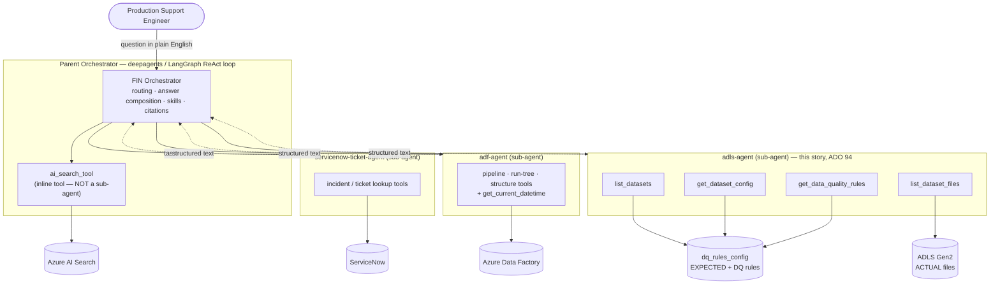
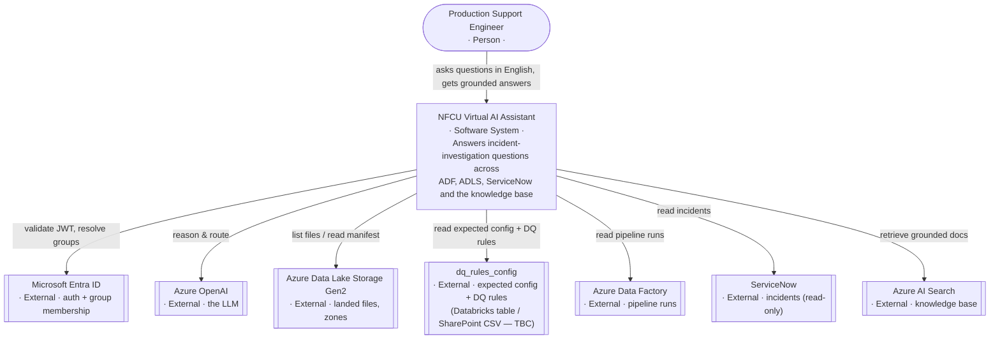
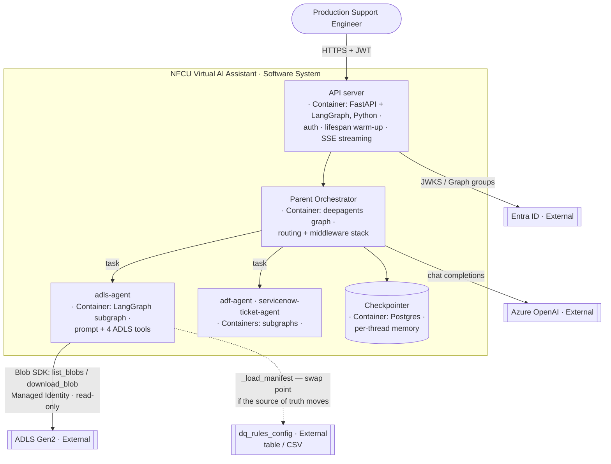
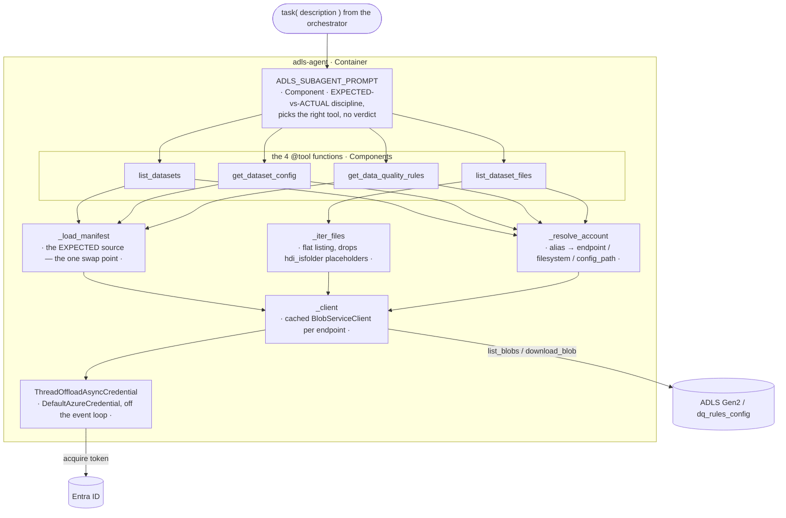

# adls_design.md — the ADLS Agent, from first principles

**Audience:** you, working on ADLS for the first time. This is the "explain it
to me like I've never touched Azure Data Lake before, then show me exactly how
our agent talks to it, then give me the questions to take to the business" doc.

**Source material:** [ADO #94](https://dev.azure.com/NFCUOrg/NFCU%20Virtual%20AI%20Assistant%20Project/_workitems/edit/94),
the [meeting notes](meeting_notes.md) (Jul 21 entry + action items #17–#20), the
DQ-config screenshots Poonam shared ([image manifest](../../MyTaskImages/UserStory94-ADLS-IMAGE-MANIFEST.md)),
and the code that already exists: [tools.py](../src/v1/core/tools/adls/tools.py).
The deep engineering write-up is [architecture/ADLS.md](architecture/ADLS.md); this
doc is the on-ramp to it.

---

## 0. The one-paragraph version

An **ADLS Agent** is a sub-agent that, given a dataset name, tells a Production
Support Engineer two things during an incident: **what a data file was supposed
to be** (where it should land, when it's due, what it's called, and which
quality rules it must pass) and **what actually showed up** (the real file, its
size, when it landed). It reads both from **Azure Data Lake Storage Gen2**. Your
instinct — "I assume it's a Blob" — is *almost* right, and the gap between
"almost" and "right" is the most important thing in this doc, so it goes first.

---

## 1. What is ADLS — and why it is "more than a Blob"

### 1a. Start with Blob Storage (the part you already had right)

Azure **Blob Storage** is object storage: an account holds **containers**, and a
container holds **blobs** (files). Critically, it is **flat**. A blob named
`raw/alpha/cur_alpha/2026/07/21/file.csv` is not "a file inside five nested
folders" — the whole thing is a single flat key, and the slashes are just
characters in the name. There are no real directories; "folders" are a fiction
the portal draws by grouping on the `/` in names. This is fine for storing
files, and it's why your BLOB assumption isn't wrong — the bytes really do live
in a blob account.

### 1b. Now add the Hierarchical Namespace — this is ADLS Gen2

**Azure Data Lake Storage Gen2 is Blob Storage with a feature flag flipped on:
the Hierarchical Namespace (HNS).** When HNS is on, the account gains a **real
directory tree** — actual directory objects, not name-prefix illusions. That one
switch is the entire difference between "a blob account" and "a data lake," and
it buys four things a flat blob account cannot do:

| Capability HNS adds | Why a data lake needs it |
|---|---|
| **Real directories** | `raw/`, `landing/`, `curated/` are objects you can operate on, not just shared prefixes |
| **Atomic directory rename/move** | Renaming a folder of 10,000 files is one metadata operation, not 10,000 copies — this is how ingestion jobs "promote" a batch from staging to landing safely |
| **POSIX-style ACLs** | Per-directory and per-file read/write/execute permissions (`rwx`) on top of Azure RBAC — a bank needs directory-level access control on sensitive data |
| **A second endpoint (`dfs`)** | A filesystem-semantics API (`.dfs.core.windows.net`) alongside the blob API (`.blob.core.windows.net`) — both address the same account |

So: **an ADLS Gen2 filesystem *is* a blob container** (you can hit it with the
blob API), **but it is more than a blob container** (it also has a real
directory tree, atomic directory ops, and POSIX ACLs). That's the sentence to
remember. "More than a Blob" = **Blob + hierarchical namespace.**

### 1c. The two endpoints, the two URL forms, and `abfss://`

Because a Gen2 account has both APIs, you will see the same account written
three ways. They are all the same storage:

| Form | Looks like | Who uses it |
|---|---|---|
| **Blob endpoint** | `https://<acct>.blob.core.windows.net` | the Blob SDK (what our agent uses) |
| **DFS endpoint** | `https://<acct>.dfs.core.windows.net` | the Data Lake filesystem SDK; the Azure portal usually hands you this one |
| **`abfss://` URI** | `abfss://<filesystem>@<acct>.dfs.core.windows.net/<path>` | Spark / Databricks / ADF — the "Azure Blob File System (Secure)" driver |

When you see `abfss://landing@prod.dfs.core.windows.net/payments/txn/` in a
ServiceNow incident or a pipeline definition, decode it as: **filesystem**
`landing`, on the **prod** account, path `payments/txn/`. It's the same lake our
agent reads, addressed the way Spark addresses it. Our code accepts either the
`.dfs.` or `.blob.` URL and normalizes to `.blob.` internally
([`_blob_endpoint`](../src/v1/core/tools/adls/tools.py)), so an operator can
paste whichever the portal gave them.

### 1d. The "zero-byte folder" gotcha (a direct consequence of 1b)

Here's where HNS bites you, and it's worth internalizing because it's the one
thing the offline tests originally got *wrong*. On an HNS account, **every
directory also exists as a zero-byte blob** carrying the metadata flag
`hdi_isfolder=true`. When you do a flat blob listing, those folder-blobs come
back mixed in with the real files:

```
raw/alpha/cur_alpha/2026/07/21                          0 bytes   hdi_isfolder=true   ← a folder
raw/alpha/cur_alpha/2026/07/21/cur_alpha_20260721.csv  78 bytes                       ← the real file
```

If you don't filter those out, the agent will cheerfully report the folder
`.../2026/07/21` as "a 0-byte file that arrived" — which is exactly the wrong
answer during an arrival investigation. Our fix is one filter in the single
listing helper (`_iter_files`), and the listing *must* request
`include=["metadata"]` or `blob.metadata` is `None` and every folder looks like
a file. A plain (non-HNS) blob account simply has no such folder-blobs, so the
same code is correct there too. **This gotcha only exists because Gen2 is more
than a blob.**

---

## 2. The requirement — what ADO #94 actually asks for

> *As a Production Support Engineer, I want to query an AI-powered ADLS Agent to
> retrieve file metadata, file configuration, and data quality rules from Azure
> Data Lake Storage, so I can quickly understand the expected file
> characteristics, storage location, and DQ rules during incident
> investigation.*

Broken into the five capabilities the Jul 21 meeting enumerated, and how each is
delivered today:

| # | Capability | Delivered by |
|---|---|---|
| 1 | Expected **file path** for the dataset | `get_dataset_config` → `expected file path` |
| 2 | Expected **file arrival SLA** (feeds the timeliness check) | `get_dataset_config` → `expected arrival SLA` |
| 3 | Expected **file metadata** — source system, dataset, file name, ingestion frequency | `get_dataset_config` → `expected file metadata` |
| 4 | Configured **data quality rules** | `get_data_quality_rules` |
| 5 | **Structured responses** back to the Parent Orchestrator | every tool returns stable `label: value` lines |

Two things the story deliberately does **not** ask the agent to do, and it
doesn't:

- **It does not render a verdict.** It reports "expected by 06:00 ET; newest file
  landed 08:12 UTC" and stops. Whether that's *late* is the downstream
  **timeliness** agent's job. The story's words are "**enable** downstream
  timeliness + DQ validation" — enable, not be. If both agents computed lateness
  you'd have two answers to one question.
- **It never writes.** Read-only, by construction (see §4).

---

## 3. The orchestration picture (the "full picture")

The ADLS agent is **not** a standalone app you call. It is a **sibling
sub-agent** hanging off the same Parent Orchestrator as the ADF agent and the
ServiceNow agent. The orchestrator owns the conversation; each sub-agent owns one
capability and its own tools. Same pattern for all three — "if you know one, you
know the others."

```
        Production Support Engineer
                   │  "Did today's payment_txn_src file arrive, and what DQ rules does it have?"
                   ▼
┌──────────────────────────────────────────────────────────────────┐
│  PARENT ORCHESTRATOR  (a LangGraph ReAct loop)                    │
│                                                                  │
│  • Auth: validate JWT (Entra ID), resolve the caller's groups    │
│  • SubagentAccessMiddleware: is this caller allowed ADLS?        │
│       caller ∉ ADLS_DISABLED_GROUPS  → yes, proceed              │
│  • Reads its system prompt + ADLS_ROUTING_BLOCK                  │
│  • Routing rule: a question about a file's location / SLA /      │
│    source / DQ rules / whether it landed → delegate to adls-agent│
│  • GOLDEN RULE: ONE capability per step — never in parallel.     │
│    A "did it arrive AND what pipeline writes it" question is TWO │
│    sequential steps: adls-agent first, then adf-agent.          │
│                                                                  │
│         │ task(subagent_type="adls-agent", description=…)        │
│         ▼                                                        │
│   ┌────────────────────────────────────────────────────────┐    │
│   │  ADLS SUB-AGENT  (its own ReAct loop, its own prompt,   │    │
│   │  its own 4 tools, a fresh isolated context)             │    │
│   │                                                         │    │
│   │   Step A: get_dataset_config("payment_txn_src")         │    │
│   │            → EXPECTED path, SLA, file name, frequency   │    │
│   │   Step B: get_data_quality_rules("payment_txn_src")     │    │
│   │            → the configured DQ rules                    │    │
│   │   Step C: list_dataset_files("payment_txn_src")         │    │
│   │            → what ACTUALLY landed, newest first         │    │
│   │                                                         │    │
│   │   each tool:  resolve account → call Azure → format     │    │
│   │               into an "[adls-agent] …" string           │    │
│   └───────────────────────────┬─────────────────────────────┘    │
│                               │  (structured text, last AI msg)  │
│         final answer ◄────────┘  returned as ONE ToolMessage     │
└──────────────────────────────────────────────────────────────────┘
                   │
                   ▼
        ┌────────────────────────────────────┐
        │  AZURE DATA LAKE STORAGE Gen2       │
        │                                     │
        │  config/datasets/<ds>.json  ◄─ EXPECTED (the "contract")
        │  landing/… , raw/… landed files ◄─ ACTUAL (what's really there)
        └────────────────────────────────────┘
```

Things worth stating out loud about this picture:

- **The parent never touches Azure itself.** The ADLS tools exist *only* inside
  the sub-agent. The only path in is the `task` delegation — which is exactly the
  choke point the access middleware gates per caller group.
- **The sub-agent is ephemeral and isolated.** It starts from a fresh
  `HumanMessage(description)` the parent wrote; it does not see the whole
  conversation. When its loop finishes, only its *final text* goes back to the
  parent — all its intermediate tool chatter is discarded.
- **Conditional wiring.** The ADLS agent and its routing block are registered
  **only if** `ADLS_ACCOUNT_MAPPING` is set. A deployment with no lake configured
  is never even told the capability exists.
- **Full engine-room version:** [architecture/ORCHESTRATION_FLOW.md](architecture/ORCHESTRATION_FLOW.md).

---

## 3A. Architecture diagrams (C4 model)

The same system at four zoom levels: **the whole agent family**, then the C4
trio — **Context** (system in its world), **Container** (the runnable pieces),
and **Component** (inside the `adls-agent`). Read them top-to-bottom; each one
zooms into the box the previous one drew.

### The agent family — parent orchestrator + all sub-agents



**One rule governs all of it:** the orchestrator uses **one capability per
step, never in parallel**. The knowledge base is a *tool* the parent calls
inline; ServiceNow, ADF, and ADLS are *sub-agents* reached only through the
shared `task` delegation — which is the exact choke point the per-caller access
gate sits on.

### C1 — Context diagram (the system in its world)



The ADLS story adds **two** external dependencies, not one: the lake itself
(**ACTUAL**) and wherever `dq_rules_config` lives (**EXPECTED**). Keeping them
as separate boxes here is the whole point of §4a.

### C2 — Container diagram (the runnable pieces)



**Conditional wiring:** the `adls-agent` container exists only when
`ADLS_ACCOUNT_MAPPING` is set. No lake configured → the container is never
built and the orchestrator is never told the capability exists.

### C3 — Component diagram (inside the `adls-agent`)



Everything routes through **one** listing helper (`_iter_files`) and **one**
EXPECTED loader (`_load_manifest`) — which is why the Gen2 folder-placeholder
filter (§1d) can't regress in just one tool, and why moving `dq_rules_config`
off the lake touches exactly one component.

---

## 4. The specifics of the ADLS call — how the agent talks to the lake

This is the part you asked to go deep on. There are **four tools**, but they make
only **two fundamentally different kinds of call**, and the whole design rests on
keeping them apart.

### 4a. The two reads (EXPECTED vs ACTUAL)

| | Question | Azure call | Source of truth |
|---|---|---|---|
| **EXPECTED** | Where *should* it land, by when, which rules? | `download_blob("config/datasets/<ds>.json")` | a JSON config file in the lake |
| **ACTUAL** | What *did* land, how big, when? | `list_blobs(name_starts_with=<prefix>, include=["metadata"])` | the live blob listing |

The lake **only knows the ACTUAL** — a blob listing tells you name, size,
last-modified, nothing more. It has no idea what *should* have arrived. So the
EXPECTED half has to be read from somewhere. Today that's a per-dataset JSON
manifest stored in the lake itself (see §5). **The single most important
behavioral rule:** the agent never presents an EXPECTED value as evidence the
ACTUAL file arrived.

### 4b. Authentication — no keys, ever

```
DefaultAzureCredential  (wrapped in ThreadOffloadAsyncCredential)
   ├─ locally  → your `az login` session
   └─ deployed → the app's Managed Identity
```

- **No connection strings, no account keys, no secrets** are stored anywhere.
- The identity needs exactly one role: **Storage Blob Data Reader**.
- The tools call **only** `list_blobs` and `download_blob` — so "read-only" is a
  property of *the code*, not just of policy. There is no write path to misuse.
- Why the thread-offload wrapper: the native async credential blocks the event
  loop while acquiring a token, which `langgraph dev`'s blocking-call detector
  rejects. Same adapter the ADF agent uses.

### 4c. Which SDK, and why the *Blob* one

We use **`azure-storage-blob`**, not `azure-storage-file-datalake`. Given §1's
"Gen2 is more than a blob," that might look backwards — so here's the reasoning:
a Gen2 filesystem *is* a blob container, everything we do is **flat listing +
whole-file reads**, and the blob SDK does both. The datalake SDK only adds
directory and ACL semantics — the "more than a blob" parts — and these read-only
tools never touch those. Blob SDK was already a dependency; datalake would be a
new one for nothing. (If we ever need directory-level ops or ACL reads, that's
when we add it.)

### 4d. The four tools, concretely

| Tool | Azure call under the hood | Returns |
|---|---|---|
| `list_datasets()` | `list_blobs` over `config/datasets/` | the `.json` stems — which datasets have a config |
| `get_dataset_config(dataset)` | `download_blob` the manifest | expected path + SLA + file metadata (reqs 1–3 in one round trip) |
| `get_data_quality_rules(dataset)` | `download_blob` the same manifest | every DQ rule (req 4) |
| `list_dataset_files(dataset\|path)` | `list_blobs` over the expected path | what actually landed: path, size, last-modified UTC, newest first, capped at 40 |

Two implementation notes you'll want when reading the code:

- **Prefix listing from a template.** Expected paths are templates like
  `raw/alpha/cur_alpha/{yyyy}/{MM}/{dd}/`. The code takes the literal head up to
  the first `{` and lists from there (`_literal_prefix`), so date folders are
  *discovered*, not computed. Marked with a `ponytail:` comment: a template whose
  token comes *early* (`raw/{yyyy}/alpha/`) would over-list — fix that only if
  such a layout shows up.
- **Errors come back as text, never exceptions.** Every failure (auth,
  permission, unknown dataset) returns an `[adls-agent] ERROR …` string so the
  model can read it and react, instead of crashing the run.

### 4e. What's proven vs what's assumed

Built and verified **end-to-end on 2026-07-21** against a *real* Gen2 account
(`stnfcuadlsagent`, HNS on) with real files and no NFCU data: all four tools, the
managed-identity auth, the orchestrator routing to it unaided from plain English,
and the EXPECTED-vs-ACTUAL discipline holding without extra prompting. **The
unknown is not whether it works — it's which door NFCU will open** (see §6).

---

## 5. The one genuinely open design decision: where does "EXPECTED" really live?

Our working assumption is a **per-dataset JSON manifest in the lake**
(`config/datasets/<dataset>.json`), because it puts the contract next to the data
and needs no extra service. Example
([full sample](sample_adls_dataset.json)):

```json
{
  "dataset": "cur_alpha_daily",
  "source_system": "Alpha Core Banking",
  "file_name_pattern": "cur_alpha_{yyyyMMdd}.csv",
  "ingestion_frequency": "Daily",
  "expected_path": "raw/alpha/cur_alpha/{yyyy}/{MM}/{dd}/",
  "arrival_sla": { "expected_by": "06:00", "timezone": "America/New_York", "grace_minutes": 60 },
  "data_quality_rules": [
    { "rule_id": "DQ-001", "column": "account_id", "rule_type": "not_null",
      "severity": "critical", "description": "Account id must always be present" }
  ]
}
```

**The screenshots (now seen in full) confirm the *real* NFCU config is richer
than our manifest, and it lives in a `dq_rules_config` table** — one row **per
dataset per zone** — shared as a `dq_rules_config.csv` on SharePoint
(`.../sites/PRJ_ETS_63648/...`). Our simple manifest is a flattening of it. The
mapping matters because it's the crux of the open question:

| Real NFCU `dq_rules_config` (columns A–Q) | Our manifest field | Notes |
|---|---|---|
| `source` (`speedpay check`), `source_alias` (`SPEEDPAY CHECK PAYMENTS`) | `source_system` | a coded source *and* a business alias |
| `table_name` (`speedpay_check_analytics`), `column_name` | dataset / rule `column` | keyed by **table**, `column_name` was `null` on the timeliness rows |
| `etl_stage` — `PCUR` / `LND` / `INT` (and `CUR`) | *(no equivalent)* | rules exist **per zone** — one row each for Landing / Integration / (Pre)Curated |
| `dq_rule_id` — `TLE` / `CLE` | `rule_type` | **TLE = Timeliness**, **CLE = Completeness** |
| `dq_parameters` (JSON) — `file_name`, `source_base_path` (`abfss://lnd-sourcing2@dt{env}eussensitiveadls.dfs.core.windows.net/lnd/speedpay-check/archive/`), `source_base_folderpath`, `raw_path` (`/mnt/raw/speedpay-check/`), `ingestion_cadence` (`Daily`), `ingestion_days` (weekday list), `partition_column`, `insert_timestamp`, `is_cdc_table`, `int_table_name`, `file_name_options` | `expected_path` + `arrival_sla` + `file_name_pattern` | our path/SLA/name are all **inside** their `dq_parameters` blob; note `raw_path` is a **Databricks `/mnt` mount**, and `source_base_path` is a real `abfss://` on `dt{env}eussensitiveadls` |
| `threshold_cnt`, `threshold_pct` (`0`) | *(no equivalent)* | pass/fail thresholds per rule |
| `oprl_configs` — `PublishSnow:True`, `PublishEmail(s)`, `SnowQueue: "ENTERPRISE DATA LAKE DQ MONITORING"` | *(no equivalent)* | **what to do on failure: raise a Snow ticket to the DQ queue + email** — this is separate from the pipeline-failure queue ("MISSION DATA - SUPPORT TEAM" in the incident payload) |
| `sort_order` (`2/1/-1`), `active_flag` (`Y`), `quarantine_flag` (`N`) | *(no equivalent)* | operational flags |
| `business_unit` (`Lending`), `notes`, `created_on`, `last_modified_on` | (renders under `other attributes`) | governance metadata; `notes` say "Timeliness Check for Curated/Landing zone", "Completeness Check" |
| The note **"update TT to ['13:30']"** | part of `arrival_sla` | **TT = Time Target** — the due-time list, applied per zone |

The good news, and the reason this is a *contained* risk: **the entire "where
does EXPECTED live" decision is isolated behind one function, `_load_manifest`.**
If the answer is "it's a Delta/SQL `dq_rules_config` table" or "it's behind a
MuleSoft API," only that function changes — every tool above it, the prompt, the
access gate, and all the tests are unaffected. That isolation was deliberate,
precisely because we knew this question was open ([action item #17](meeting_notes.md)).

The full solution-options analysis (Direct ADLS vs Databricks SQL vs MuleSoft
API, with the recommendation) is in
[ADLS_SOLUTION_DESIGN_OPTIONS.md](ADLS_SOLUTION_DESIGN_OPTIONS.md). The short
version of the recommendation: **query the config as a table (Databricks) and
answer "did the file land" against the filesystem (Direct ADLS) — a hybrid** —
with the MuleSoft API as the fallback if NFCU blocks direct storage access.

---

## 5A. How we mock the real NFCU setup in Azure (from Poonam's samples)

Goal: stand up a **sandbox Gen2 account that looks like the real one** so the
agent is exercised against the real *shape* — no NFCU data copied, only the
structure. Everything below is traced to a specific screenshot.

### What the samples actually told us (confirmed, not assumed)

| Thing | Value seen in the screenshots | Column |
|---|---|---|
| Real account + filesystem | `abfss://lnd-sourcing2@dt{env}eussensitiveadls.dfs.core.windows.net/lnd/speedpay-check/archive/` | `dq_parameters.source_base_path` |
| Databricks mount | `raw_path: /mnt/raw/speedpay-check/` | `dq_parameters.raw_path` |
| Zones (one row each) | `LND`, `INT`, `PCUR` (notes also say **Curated**) | `etl_stage` |
| Rule types | `TLE` = Timeliness, `CLE` = Completeness | `dq_rule_id` |
| Table / dataset | `speedpay_check_analytics` | `table_name` |
| Source + alias | `speedpay check` / `SPEEDPAY CHECK PAYMENTS` | `source`, `source_alias` |
| File name (INT) | `{filedate},WU_to_NFCU_speedpay_check_analytics` | `dq_parameters.file_name` |
| Cadence + days | `Daily`, `ingestion_days: [Monday, Tuesday, Wednesday, …]` | `dq_parameters` |
| Time target (SLA) | note: *"updating **TT** to `["13:30"]` in lnd and int"* | `notes` |
| On failure | Snow ticket to queue **"ENTERPRISE DATA LAKE DQ MONITORING"** + emails | `oprl_configs` |
| Thresholds / flags | `threshold_pct: 0`, `active_flag: Y`, `quarantine_flag: N`, `sort_order: 2/1/-1` | `G–K` |
| Business unit | `Lending` | `business_unit` |

**Assumed (not in the samples), so flagged:** the sandbox account name, that one
`adls` filesystem stands in for `lnd-sourcing2`, and that our per-dataset JSON
manifest is an acceptable stand-in for a `dq_rules_config` row-set (§5).

### Step 1 — create the Gen2 account (mirrors `dt{env}eussensitiveadls`)

```bash
# --hns true is the ONLY thing that makes it a data lake, not plain blob (§1b)
az storage account create -n stnfcuadlssbx -g rg-nfcu-adf-wiki -l eastus2 \
  --sku Standard_LRS --hns true \
  --allow-blob-public-access false --min-tls-version TLS1_2
```

### Step 2 — filesystem + the zone folders seen in the config

```bash
# Real names its filesystem 'lnd-sourcing2'; one 'adls' filesystem is enough for the sandbox
az storage fs create -n adls --account-name stnfcuadlssbx --auth-mode login

# Zone/path folders, straight from source_base_path + etl_stage
for d in "lnd/speedpay-check/archive" "int/speedpay-check" "cur/speedpay-check" "config/datasets"; do
  az storage fs directory create -f adls -n "$d" --account-name stnfcuadlssbx --auth-mode login
done
```

### Step 3 — the dataset config (real row-set → our manifest)

Translate the three `speedpay_check_analytics` rows into one manifest. Every
value below is copied from a screenshot; nothing invented:

```json
{
  "dataset": "speedpay_check_analytics",
  "source_system": "Speedpaycheck",
  "source_alias": "SPEEDPAY CHECK PAYMENTS",
  "file_name_pattern": "{filedate},WU_to_NFCU_speedpay_check_analytics",
  "ingestion_frequency": "Daily",
  "ingestion_days": ["Monday", "Tuesday", "Wednesday", "Thursday", "Friday"],
  "expected_path": "lnd/speedpay-check/archive/",
  "arrival_sla": { "time_target": ["13:30"], "timezone": "America/New_York" },
  "business_unit": "Lending",
  "data_quality_rules": [
    { "rule_id": "TLE", "etl_stage": "LND",  "rule_type": "timeliness",   "threshold_pct": 0 },
    { "rule_id": "TLE", "etl_stage": "PCUR", "rule_type": "timeliness",   "threshold_pct": 0 },
    { "rule_id": "CLE", "etl_stage": "INT",  "rule_type": "completeness", "threshold_pct": 0 }
  ],
  "on_failure": { "snow_queue": "ENTERPRISE DATA LAKE DQ MONITORING", "publish_snow": true, "publish_email": true }
}
```

```bash
az storage fs file upload -f adls -s ./speedpay_check_analytics.json \
  -p "config/datasets/speedpay_check_analytics.json" \
  --account-name stnfcuadlssbx --auth-mode login
```

> `ingestion_days`, `time_target`, and `on_failure` are **extra** keys — the
> agent renders them under *other attributes* with no code change (§5). Keep the
> four core keys (`file_name_pattern`, `expected_path`, `arrival_sla`,
> `data_quality_rules`) since that is what the tools read by name.

### Step 4 — a dummy "landed" file matching the pattern

```bash
echo "sandbox test row" > 20260723_WU_to_NFCU_speedpay_check_analytics.dat
az storage fs file upload -f adls -s ./20260723_WU_to_NFCU_speedpay_check_analytics.dat \
  -p "lnd/speedpay-check/archive/20260723_WU_to_NFCU_speedpay_check_analytics.dat" \
  --account-name stnfcuadlssbx --auth-mode login
```

### Step 5 — read access (no keys) + wire `.env`

```bash
az role assignment create --role "Storage Blob Data Reader" \
  --assignee <your-or-the-app-object-id> \
  --scope $(az storage account show -n stnfcuadlssbx -g rg-nfcu-adf-wiki --query id -o tsv)
```

```dotenv
ADLS_ACCOUNT_MAPPING={"nfcu-adls":{"account_url":"https://stnfcuadlssbx.dfs.core.windows.net","filesystem":"adls","config_path":"config/datasets"}}
ADLS_DEFAULT_ACCOUNT=nfcu-adls
```

### If we go the "real table" route instead of a manifest

The screenshots show the true source is a **`dq_rules_config` table** (shared as
`dq_rules_config.csv`), not per-dataset files. To mock *that* shape instead, drop
a CSV with the exact A–Q headers
(`source, table_name, column_name, etl_stage, dq_rule_id, dq_parameters,
sort_order, active_flag, quarantine_flag, threshold_cnt, threshold_pct,
oprl_configs, created_on, last_modified_on, business_unit, notes, source_alias`),
one row per zone — and point **`_load_manifest`** ([tools.py:263](../src/v1/core/tools/adls/tools.py#L263))
at it. That one function is the only thing that changes; the four tools above it
don't (§5). Which mock we invest in depends on question 4 in §6.

### Tear down

```bash
az storage account delete -n stnfcuadlssbx -g rg-nfcu-adf-wiki --yes
```

---

## 6. Questions for the business

Simple, human questions — the ones the `dq_rules_config` and incident-payload
screenshots leave open. (I've dropped the questions those images already
answered.) The goal of asking is so I can **replicate the real setup** in my
sandbox and know how to wire the agent.

### The zones

1. I can see the zones **LND, INT, PCUR** in `etl_stage` (and I've heard **CUR**
   too). Can you walk me through what each one means and the order data moves
   through them?
2. Is it **one storage account** with the zones as folders, or a **separate
   container/account per zone**? (I see one account, `dt{env}eussensitiveadls`,
   but different containers like `lnd-sourcing2` — I want to confirm.)
3. During an incident, which zone does the engineer usually care about — just
   **Landing**, or the later ones too?

### Where `dq_rules_config` really lives (my biggest one)

4. I can get **what actually landed** straight from ADLS. But the **expected**
   info (path, file name, cadence, time target) and the **DQ rules** all live in
   **`dq_rules_config`**. Where should the agent **read that from** — a real
   **table** (Databricks / SQL) the ingestion job uses, or is the
   **`dq_rules_config.csv` on SharePoint** the actual source?
5. Can I get a **sample export** of `dq_rules_config` (even a few rows) to build
   against?
6. Who **keeps it up to date**, and how often does it change?

### Reading a row

7. For **one dataset** I see **three rows** — one per zone (LND / INT / PCUR)
   with different checks (**TLE / CLE**). When someone asks about a dataset,
   should the agent show **all its rows**, or just the **one zone** they ask
   about?
8. The checks I see are **TLE (timeliness)** and **CLE (completeness)**. Are
   those the **only two types**, or are there more?
9. What does the engineer **look up by** — the **source** (`speedpay check`), the
   **source_alias** (`SPEEDPAY CHECK PAYMENTS`), or the **table_name**
   (`speedpay_check_analytics`)?
10. Is the **time target** (**TT**, e.g. `["13:30"]`) the "file is due by" time I
    should treat as the SLA? Do the **`ingestion_days`** (the weekday list) mean
    it's skipped on other days?

### Incidents and DQ failures

11. A **pipeline** failure raises a ticket to **"MISSION DATA - SUPPORT TEAM"**.
    A **DQ** failure looks like it raises its **own** ticket to **"ENTERPRISE
    DATA LAKE DQ MONITORING"** (from `oprl_configs`). Is that right — **DQ
    failures get their own tickets**, separate from pipeline failures?
12. Does the **ticket name the dataset/table** it's about (e.g.
    `speedpay_check_analytics`), or only the pipeline?

### How I connect

13. Do I read the lake **directly** (the storage account), or through
    **Databricks**? I ask because `dq_parameters` has a **`raw_path` like
    `/mnt/raw/speedpay-check/`**, which looks like a Databricks mount.
14. What are the real **`{env}`** values (dev / test / prod), and is there a
    **non-prod copy** with sample data I can develop on?

### Quick yes/no

15. Everything I see is **`business_unit: Lending`**. Is the agent just for
    **Lending**, or all business units?
16. Should the agent ever **move or reprocess** a file, or **only look and
    report**? (Today: read-only.)
17. Any datasets/paths that are **sensitive** or that the agent should **not** be
    allowed to see?

---

## 6A. Code map (for pointing at the actual lines)

Two quick tables for when someone asks "show me where that is." Line numbers are
as of 2026-07-23; the symbol names are the stable anchors if lines drift.

### Azure concept → where it lives in code

**Note:** our code does **not create** the storage account — Azure / the platform
team does that (portal or `az storage account create --hns true`). Our code only
**reads** an account that already exists.

| Azure concept | In our code |
|---|---|
| **Which account / filesystem we connect to** | `ADLS_ACCOUNT_MAPPING` — [config.py:105](../src/v1/core/config.py#L105); resolved by `_resolve_account` — [tools.py:144](../src/v1/core/tools/adls/tools.py#L144) |
| **Auth — no keys; `az login` / Managed Identity + `Storage Blob Data Reader`** | `DefaultAzureCredential` — [azure_credentials.py:42](../src/v1/utils/azure_credentials.py#L42); off-loop wrapper `ThreadOffloadAsyncCredential` — [azure_credentials.py:73](../src/v1/utils/azure_credentials.py#L73); attached at [tools.py:187](../src/v1/core/tools/adls/tools.py#L187) |
| **The storage connection (SDK client)** | `_client` (cached `BlobServiceClient`) — [tools.py:180](../src/v1/core/tools/adls/tools.py#L180); `.dfs`↔`.blob` URL fix `_blob_endpoint` — [tools.py:131](../src/v1/core/tools/adls/tools.py#L131) |
| **Gen2 hierarchical namespace (folder-vs-file gotcha)** | `_is_directory` (`hdi_isfolder`) — [tools.py:215](../src/v1/core/tools/adls/tools.py#L215); single listing helper `_iter_files` — [tools.py:228](../src/v1/core/tools/adls/tools.py#L228) |
| **The two reads: EXPECTED vs ACTUAL** | `download_blob` config → `_load_manifest` — [tools.py:263](../src/v1/core/tools/adls/tools.py#L263); `list_blobs` landed files → `list_dataset_files` — [tools.py:486](../src/v1/core/tools/adls/tools.py#L486) |

### What we actually *do* with ADLS → where it lives in code

| What we do | In our code |
|---|---|
| List which datasets have a config | `list_datasets` — [tools.py:324](../src/v1/core/tools/adls/tools.py#L324) |
| Tell the engineer what a file *should* be (path, SLA, name, source, frequency) | `get_dataset_config` — [tools.py:354](../src/v1/core/tools/adls/tools.py#L354) |
| Tell them the data-quality rules for a dataset | `get_data_quality_rules` — [tools.py:420](../src/v1/core/tools/adls/tools.py#L420) |
| Check what *actually* landed (files, size, arrival time) | `list_dataset_files` — [tools.py:486](../src/v1/core/tools/adls/tools.py#L486) |
| Keep EXPECTED vs ACTUAL separate; never declare a file late | `ADLS_SUBAGENT_PROMPT` — [adls.py:9](../src/v1/core/prompts/adls.py#L9) |
| Decide *when* to use ADLS vs ADF/ServiceNow | `ADLS_ROUTING_BLOCK` — [orchestrator.py:277](../src/v1/core/prompts/orchestrator.py#L277) |
| Register the agent only if a lake is configured | wiring table — [agent.py:149](../src/v1/core/agent.py#L149); agent + 4 tools — [subagent.py](../src/v1/core/subagents/adls/subagent.py) |
| Block ADLS per user group (access control) | `ADLS_RESTRICTION_NOTE` + gate — [subagent_access.py:105](../src/v1/core/middlewares/subagent_access.py#L105) |
| Read-only guarantee + clean shutdown | only `list_blobs`/`download_blob` exist; `close_adls_resources` — [agent.py:240](../src/v1/core/agent.py#L240) |

**The one-liner for a non-technical audience:** we read two things from the lake
— *what a file should be* (config + rules) and *what actually showed up* — and
hand both to the assistant. We never move, change, or judge anything.

---

## 7. Where to go next in the code

| You want… | Read |
|---|---|
| The deep engineering design + requirement traceability | [architecture/ADLS.md](architecture/ADLS.md) |
| The full end-to-end orchestration mechanics | [architecture/ORCHESTRATION_FLOW.md](architecture/ORCHESTRATION_FLOW.md) |
| The three access-path options + recommendation | [ADLS_SOLUTION_DESIGN_OPTIONS.md](ADLS_SOLUTION_DESIGN_OPTIONS.md) |
| The actual tool code | [src/v1/core/tools/adls/tools.py](../src/v1/core/tools/adls/tools.py) |
| How the parent decides to route here | `ADLS_ROUTING_BLOCK` in [src/v1/core/prompts/orchestrator.py](../src/v1/core/prompts/orchestrator.py) |
| The real NFCU config screenshots | [image manifest](../../MyTaskImages/UserStory94-ADLS-IMAGE-MANIFEST.md) |
