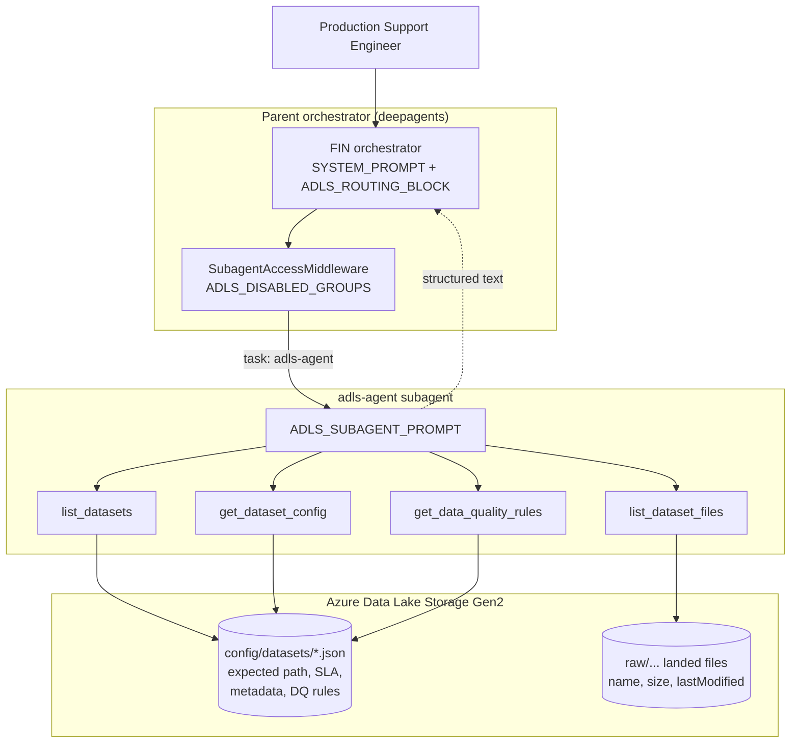

# ADLS.md — the `adls-agent` subagent

Design and walkthrough for [ADO #94](https://dev.azure.com/NFCUOrg/NFCU%20Virtual%20AI%20Assistant%20Project/_workitems/edit/94):

> As a Production Support Engineer, I want to query an AI-powered ADLS Agent to
> retrieve file metadata, file configuration, and data quality rules from Azure
> Data Lake Storage so that I can quickly understand the expected file
> characteristics, storage location, and data quality rules during incident
> investigation.

Deliberately built **parallel to the `adf-agent`**: same auth story, same
alias-resolution shape, same "errors come back as text the model reads" contract,
same conditional wiring. If you know one, you know the other.

---

## The 10-second summary

Four `@tool`-decorated async functions in `src/v1/core/tools/adls/tools.py` are
what the LLM calls. Each one: **resolve account → call the Azure blob SDK →
format the result into an `[adls-agent] …` string**. Errors are never raised to
the agent — they come back as text.

The agent answers two different kinds of question and never confuses them:

| | Question | Source of truth |
|---|---|---|
| **EXPECTED** | Where *should* the file land? By when? What columns must pass which rules? | a per-dataset JSON manifest in ADLS |
| **ACTUAL** | What *did* land, how big, and when? | ADLS blob listing |

---

## Where it sits



Sibling subagents (`adf-agent`, `servicenow-ticket-agent`) hang off the same
orchestrator; see [ORCHESTRATION_FLOW.md](ORCHESTRATION_FLOW.md).

---

## Requirement traceability

| # | ADO #94 requirement | Delivered by |
|---|---|---|
| 1 | Retrieve the expected file path | `get_dataset_config` → `expected file path` |
| 2 | Retrieve the expected file arrival SLA | `get_dataset_config` → `expected arrival SLA` |
| 3 | Retrieve expected file metadata (source system, dataset, file name, ingestion frequency) | `get_dataset_config` → `expected file metadata` |
| 4 | Retrieve configured data quality rules | `get_data_quality_rules` |
| 5 | Return structured responses to the Parent Orchestrator Agent | stable `label: value` lines under fixed section headers, every tool |
| — | *Connect to ADLS and retrieve **file** metadata* | `list_dataset_files` (name, size, lastModified) |
| — | *Enable downstream timeliness / DQ validation* | expected SLA + actual `lastModified` are both returned; the **verdict** is left to the downstream capability, by design |

Discovery (`list_datasets`) is the fifth tool-shaped need: without it the agent
cannot resolve a name the user half-remembers, and would guess paths.

---

## The dataset manifest

ADLS itself knows only what physically landed. The *expectations* live in one
JSON document per dataset at `<config_path>/<dataset>.json` inside the same
filesystem (`config_path` defaults to `config/datasets`). A full example is in
[../sample_adls_dataset.json](../sample_adls_dataset.json):

```json
{
  "dataset": "cur_alpha_daily",
  "source_system": "Alpha Core Banking",
  "file_name_pattern": "cur_alpha_{yyyyMMdd}.csv",
  "ingestion_frequency": "Daily",
  "expected_path": "raw/alpha/cur_alpha/{yyyy}/{MM}/{dd}/",
  "arrival_sla": { "expected_by": "06:00", "timezone": "America/New_York", "grace_minutes": 60 },
  "data_quality_rules": [
    { "rule_id": "DQ-001", "column": "account_id", "rule_type": "not_null",
      "severity": "critical", "description": "Account id must always be present" }
  ]
}
```

**Why a manifest in the lake and not a new service.** It puts the contract next
to the data, needs no extra dependency, and is readable by the same credential
and the same client the file listing already uses.

> **Open item (meeting notes, Jul 21 — action #17).** The enterprise source of
> truth for file config and DQ rules is not yet confirmed; it may turn out to be
> a catalog or a DQ-framework table rather than files in the lake. The blast
> radius of that change is one function — `_load_manifest`. Every tool above it,
> the prompt, the gate, and the tests are unaffected.

Unknown top-level keys are **not** dropped: `get_dataset_config` renders them
under `other attributes`, so a manifest can grow without a code change.

---

## The tools

### `list_datasets(account="")`
Flat-lists `<config_path>` and returns the `.json` stems. First step whenever
the user's dataset name needs resolving.

### `get_dataset_config(dataset, account="")`
Requirements 1–3 in one call — they are one record, so one round trip. Also
reports the DQ **rule count** and points at `get_data_quality_rules` for detail,
keeping the config response small.

Missing fields render as `(not configured)`. The agent never invents a path or
an SLA.

### `get_data_quality_rules(dataset, account="")`
Requirement 4. Renders every rule's id and then every remaining attribute
generically, so a rule schema change needs no code change.

### `list_dataset_files(dataset="", path="", last_n_days=7, account="")`
What actually landed: full path, size, `lastModified` (UTC), newest first,
capped at 40 rows like the ADF run listing. Given a `dataset` it lists from that
dataset's configured `expected_path`; given a `path` it lists that folder.

**Prefix listing.** Expected paths are templates
(`raw/alpha/cur_alpha/{yyyy}/{MM}/{dd}/`). `_literal_prefix` takes the fixed head
up to the first `{` and lists from there, so date folders are discovered rather
than computed. Marked in the source with a `ponytail:` comment: a template whose
token comes *early* (`raw/{yyyy}/alpha/`) would list a wider subtree; render the
tokens for a concrete business date if that layout appears.

---

## Configuration

| Env var | Meaning |
|---|---|
| `ADLS_ACCOUNT_MAPPING` | JSON: alias → `{account_url, filesystem, config_path?}`. **Empty disables the whole subagent.** |
| `ADLS_DEFAULT_ACCOUNT` | Which alias to use when the caller names none (implicit when only one is mapped) |
| `ADLS_DISABLED_GROUPS` | Entra groups that lose the subagent (same matching as `SERVICENOW_DISABLED_GROUPS`) |

`account_url` accepts either the `.dfs.` or the `.blob.` endpoint —
`_blob_endpoint` normalizes it, so an operator can paste whichever the portal
gave them.

**Auth.** `DefaultAzureCredential` via `ThreadOffloadAsyncCredential` (the same
adapter the ADF client uses — the native async credential blocks the event loop
during acquisition, which `langgraph dev`'s blocking-call detector rejects). No
keys or secrets: locally it uses `az login`, deployed it uses the managed
identity. The identity needs **Storage Blob Data Reader**; the tools call only
`list_blobs` and `download_blob`, so the capability is read-only by
construction.

**Why `azure-storage-blob`, not `azure-storage-file-datalake`.** A Gen2
filesystem *is* a blob container, and these tools only list and download whole
blobs. The blob SDK was already in the dependency tree; the datalake SDK adds
only directory/ACL semantics we never touch.

---

## Wiring

| Concern | File |
|---|---|
| Tools | `src/v1/core/tools/adls/tools.py` |
| Subagent definition | `src/v1/core/subagents/adls/subagent.py` |
| Subagent prompt | `src/v1/core/prompts/adls.py` |
| Orchestrator routing | `ADLS_ROUTING_BLOCK` in `src/v1/core/prompts/orchestrator.py` |
| Per-group access gate | `ADLS_RESTRICTION_NOTE` + gate in `src/v1/core/middlewares/subagent_access.py` |
| Registration + shutdown | `src/v1/core/agent.py` |
| Settings | `src/v1/core/config.py` |
| Tests | `src/v1/test/v1/utils/test_adls_tools.py` (31), `test_subagent_access.py` (16) |

**Conditional registration.** `_build_agent_sync` wires ADF and ADLS from one
table: a subagent is registered *and* its routing block appended only when its
backing resource is configured. A deployment with no data lake never hears about
a capability it does not have.

**Access gate.** The gate's `is_registered` is `bool(settings.adls_account_mapping)`,
so an unconfigured ADLS never counts toward the "every subagent disabled → drop
the `task` tool" decision. A caller who loses only ADLS keeps ServiceNow and ADF
delegation.

---

## Behavioral contract

Enforced by `ADLS_SUBAGENT_PROMPT` and `ADLS_ROUTING_BLOCK`:

- **EXPECTED ≠ ACTUAL.** A configured expectation is never presented as evidence
  a file arrived.
- **No verdict.** The agent reports "expected by 06:00 America/New_York; newest
  file landed 08:12 UTC" and stops. Timezone math and the late/on-time judgement
  belong to the orchestrator and the downstream timeliness capability — this
  story's business value is to *enable* them, not to be them.
- **One capability per step.** `adls-agent` obeys the same never-in-parallel rule
  as `ai_search_tool`, `servicenow-ticket-agent` and `adf-agent`.
- **Verbatim.** Paths, file names, byte counts, timestamps and rule ids are
  passed through unchanged.

---

## Gen2 directory placeholders (found against real Azure)

On a **hierarchical-namespace** account every folder also exists as a
**zero-byte blob** whose metadata carries `hdi_isfolder=true`, and a flat
listing returns those alongside real files:

```
raw/alpha                                              0    hdi_isfolder=true
raw/alpha/cur_alpha/2026/07/21                         0    hdi_isfolder=true
raw/alpha/cur_alpha/2026/07/21/cur_alpha_20260721.csv  78
```

Unfiltered, the agent would report `raw/alpha/cur_alpha/2026/07/21` as a 0-byte
file that *arrived* — the wrong answer during an arrival investigation, and one
that only appears against a real Gen2 account (the offline fake originally did
not reproduce it; it now does).

The filter lives in `_iter_files`, the single listing helper both
`list_datasets` and `list_dataset_files` go through, so neither can regress
independently. `include=["metadata"]` is required — without it `blob.metadata`
is `None` and every folder looks like a file. A non-HNS account simply has no
such blobs, so the same code is correct there too.

---

## Testing

```bash
make test                                             # whole suite
.venv/bin/python src/v1/test/v1/utils/test_adls_tools.py   # standalone
```

32 offline tests replace the blob client with an in-memory fake — no network, no
credentials. They cover account resolution (default / named / unknown / unset /
misconfigured), endpoint normalization, manifest loading including the
case-insensitive fallback and malformed JSON, all four tools' rendered output,
the expected-path prefix logic, Gen2 directory placeholders, the display cap,
and the subagent-name ↔ access-gate match.

### Live sandbox

Verified end to end on 2026-07-21 against a real ADLS Gen2 account:

| | |
|---|---|
| Account | `stnfcuadlsagent` (rg-nfcu-adf-wiki, eastus2, **HNS on**, Standard_LRS) |
| Filesystem | `adls` |
| Datasets | `cur_alpha_daily` (date-partitioned path), `payment_txn_src` (flat landing path) |
| Auth | `az login` locally / managed identity deployed — no keys |

Seeded with two manifests under `config/datasets/` plus five dummy data files.
The flat `landing/payments/txn/` dataset deliberately mirrors the path shape seen
in real incident text (`abfss://landing@prod/payments/txn/`), so both folder
layouts are exercised — see open question A3.

Confirmed working: all four tools directly, and two natural-language questions
through the **orchestrator**, which routed to `adls-agent` unaided. The
expected-vs-actual discipline held without extra prompting — asked whether a file
was late, the agent reported the SLA and the actual timestamp and explicitly
declined to issue the verdict.

Tear down with:

```bash
az storage account delete -n stnfcuadlsagent -g rg-nfcu-adf-wiki --yes
```

---

## Deliberately not built

| Skipped | Add when |
|---|---|
| An SLA **verdict** tool (on-time / late / missing) | the timeliness agent lands — it owns that judgement, and duplicating it here would create two answers to one question |
| Rendering `{yyyy}/{MM}/{dd}` tokens for a business date | a dataset appears whose template puts a token before the literal head |
| A local mock mode (`ADLS_MODE=mock`) | the `adf-agent` gets one — parity beats a one-off; the fake-client tests already cover the logic |
| `azure-storage-file-datalake` | directory-level or ACL operations are actually needed |
| Writing to ADLS | never, without a new story — read-only is a security property here |
